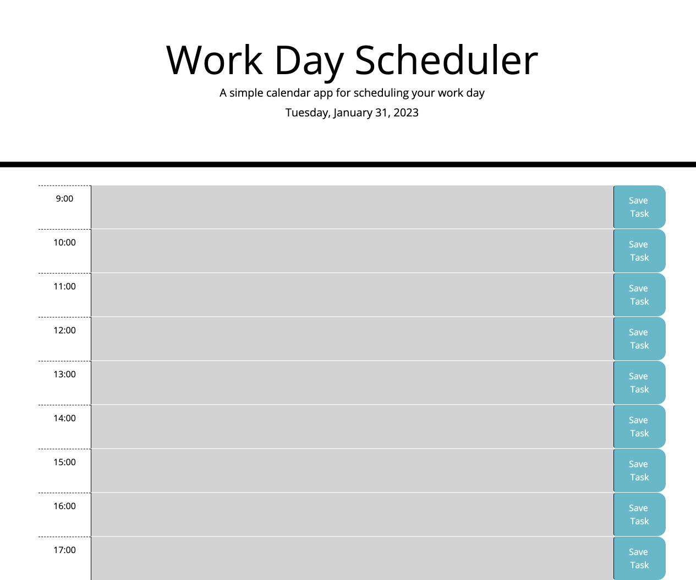
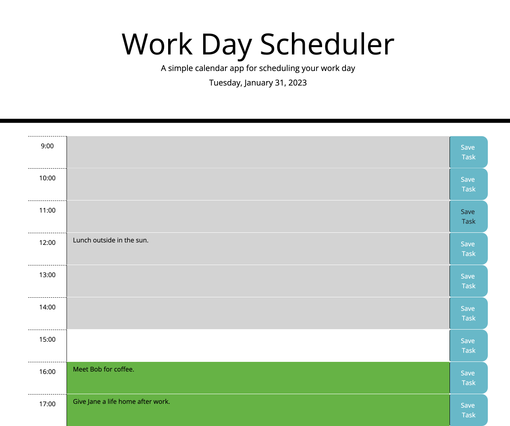

# Workday-planner

## Description 
This project was created to test understanding of moment.js as well as other functions such as set interval and Jquery. The page allows users to enter tasks in a text area for each hour of the working day and save them to local storage. By saving them they can exit the page and revisit the same day to see their tasks at any time. The page also updates the styles of each hour depending on the time of day. Grey blocks showing past events, white for the current hour, and green for any open or future slots. 
I also wanted to add a feature that was not required, but made sense for an application of this type. I wanted to local storage to automatically clear each day, so the user didnt have to amnually clear their storage to stop old tasks loading. I manged to add the feature byt also saving the date the tasks were saved to the local storage and then when getting the items from storage was able to compare them to the current date, and either display or clear them depending on if they were the same.

## Usage
The page has a simple functionality. Each hour has a textarea and a save button. Users must enter the task for that hour and click save on the function. Due to the function added to clear automatically on the next day the user does not need to worry about manually clearing their storage after their working day. 

Below is a link to the deployed web page:
https://harryunderscore13.github.io/Workday-planner/

Below are screenshots of the webpage:

